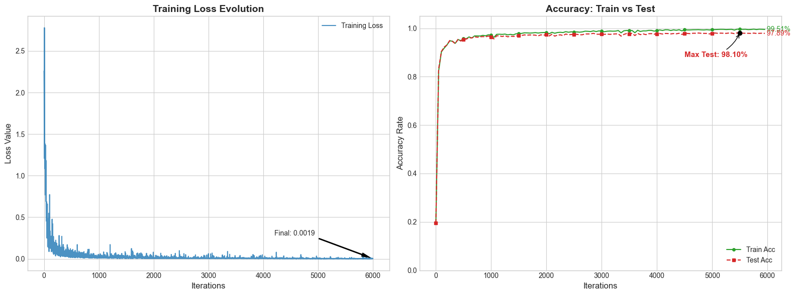
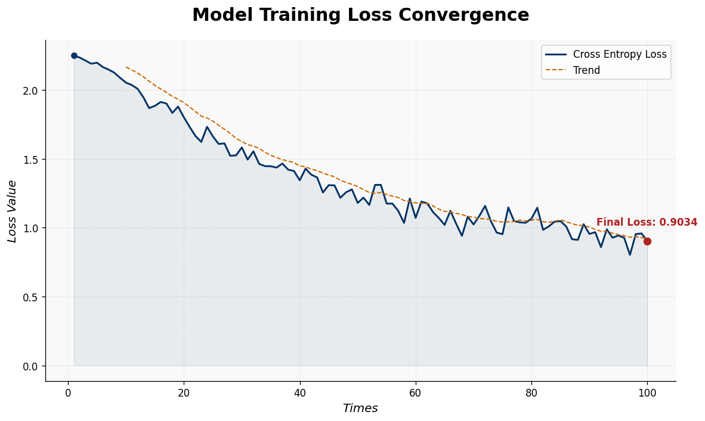

# 📚 Fish-Book-Notes: 深度学习从零实现

本项目是我在学习《深度学习入门：基于Python的理论与实现》（斋藤康毅 著）过程中的**随书笔记**与**自主代码实现**。

项目的核心目标是：**不依赖外部深度学习框架（如 PyTorch、TensorFlow）**，仅使用 Python 和 NumPy 从零构建神经网络，从而深刻理解深度学习的底层原理（如反向传播、卷积运算等）。

---

## 🛠️ 环境要求与配置

本项目开发环境基于 **Windows Subsystem for Linux (WSL2)**，并使用高性能 Python 包管理器 [**uv**](https://github.com/astral-sh/uv) 进行依赖管理。

### 1. 环境
*   **OS**: WSL2 (Ubuntu 22.04+ 推荐)
*   **Package Manager**: `uv` (0.9.26+)
*   **Python**: 3.14+

### 2. 快速开始
如果你已经安装了 `uv`，可以通过以下命令快速克隆并初始化环境：

```bash
# 克隆仓库
git clone https://github.com/你的用户名/你的项目名.git
cd 你的项目名

# 创建虚拟环境并安装依赖
uv venv
source .venv/bin/activate
uv sync
```

---

## 🚀 学习进展 & 实验记录

### 📅 2026-01-20 - 引入反向传播：性能与精度的飞跃

今天实现了**反向传播算法 (Backpropagation)** 并将其应用到两层神经网络中。相比于之前的数值梯度，计算效率有了质的提升，模型表现也达到了准商用级别。

#### 1. 实验配置
*   **核心改进**: 放弃了耗时的数值梯度，改用高效的 **计算图 (Computational Graph)** 链式法则实现梯度计算。
*   **模型参数**: 
    *   输入层: 784 | **隐藏层: 256** | 输出层: 10
*   **超参数**:
    *   优化器: **SGD (随机梯度下降)**
    *   学习率 (Learning Rate): **0.5**
    *   训练轮数 (Epochs): **100**

#### 2. 训练表现
*   **极致收敛**: Loss 函数最终降至 **0.0019**，收敛过程极度平滑。
*   **准确率**:
    *   **训练集准确率**: **99.51%** (几乎完美拟合训练数据)
    *   **测试集准确率**: **98.10%** (泛化性能优秀)
*   **性能提升**: 反向传播使单次迭代耗时缩短了几个数量级，支撑了更大规模的隐藏层（256 节点）和更多的训练轮数。

#### 3. 训练监控图


> **💡 心得**: 从 82% 到 98.1% 的跨越，不仅是隐藏层节点的增加，更是因为反向传播让我们能够高效地进行深层/宽层网络的训练。0.5 的学习率在本次配置下表现非常稳定。

---

### 📅 2026-01-19 - 迈出第一步：第一个神经网络实现

今天成功实现了书中的 **两层神经网络 (TwoLayerNet)**，并完成了从零开始的完整训练流程。

#### 1. 实验配置
*   **模型结构**: 
    *   输入层: 784 | 隐藏层: 50 | 输出层: 10
*   **求导方式**: **数值梯度 (Numerical Gradient)** —— 纯手动实现，未引入反向传播。
*   **超参数**: Batch Size: 100 | Iterations: 100 | Learning Rate: 1.0

#### 2. 训练表现
*   **最终精度**: 在测试集上达到了约 **82%** 的准确率。
*   **痛点**: 数值梯度计算极其缓慢，难以进行大规模 Epoch 训练。

#### 3. Loss 曲线图


---

## 🤝 声明

1.  **学习用途**：本项目仅用于个人学习和技术交流。
2.  **版权说明**：代码逻辑参考了斋藤康毅所著的《深度学习入门：基于Python的理论与实现》，部分数据集加载脚本（如 `mnist.py`）源自原书配套源码。
3.  **笔记原创**：项目中的笔记与中文注释均为个人理解整理，如有谬误欢迎指正。